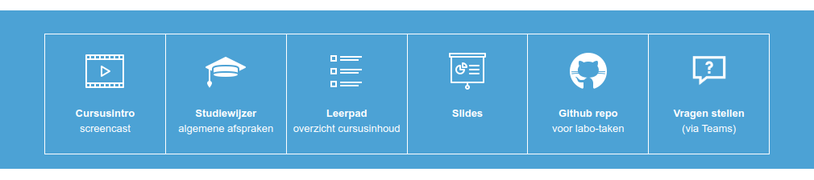

# Chamilo cursus-intro banner

Voorzie een banner met tegels met links naar de belangrijkste info over je Chamilo-cursus in de cursusintroductie.



## Info over de cursus

De nodige info over de cursus die je in de tegels wilt tonen, vat je samen in een YAML-bestand, bv.:

```yaml
---
background_color: "rgb(76, 162, 213)"
foreground_color: "rgb(255, 255, 255)"
tiles:
  - line1: "Studiewijzer"
    line2: "begin hier!"
    img: "https://img.icons8.com/ios-filled/2x/ffffff/graduation-cap.png"
    url: "https://chamilo.hogent.be/..."
  - line1: "Leerpad"
    line2: "overzicht cursusinhoud"
    img: "https://img.icons8.com/ios/2x/ffffff/overview-pages-4.png"
    url: "https://chamilo.hogent.be/..."
  - line1: "Slides"
    line2: ""
    img: "https://img.icons8.com/ios/2x/ffffff/presentation.png"
    url: "https://hogenttin.github.io/infra-slides/"
  - line1: "Github repo"
    line2: "voor labo-taken"
    img: "https://img.icons8.com/ios-filled/2x/ffffff/github.png"
    url: "https://classroom.github.com/a/JfZTZ4Xa"
  - line1: "Vragen stellen"
    line2: "via Teams"
    img: "https://img.icons8.com/windows/2x/ffffff/question-mark.png"
    url: "https://chamilo.hogent.be/..."
```

Het bestand moet 3 variabelen definiëren:

- `background_color`: achtergrondkleur van de banner (in een formaat dat door HTML/CSS herkend wordt), bij voorkeur een kleur uit het HOGENT-kleurenpalet (zie verder)
- `foreground_color`: kleur van het kader en de tekst (in een formaat dat door HTML/CSS herkend wordt)
- `tiles`: tegels die je wilt toevoegen, een lijst van dicts met als keys:
    - `line1`: 1e tekstregel
    - `line2`: 2e tekstregel
    - `img`: URL naar het icoontje of picto die je wil tonen (liefst in dezelfde kleur als `foreground_color`)
    - `url`: de link waar je naar doorgestuurd wordt als je op de tekst of picto klikt

## HTML-code genereren

Genereer de nodige HTML-code met:

```console
./course-intro.py infra-nl.yml
Processing infra-nl.yml -> infra-nl.html
```

Je kan meerdere bestanden ineens meegeven. Het resultaat is een of meerdere HTML-bestanden die je kan bekijken in een webbrowser.

Om dit toe te passen op je Chamilo-cursus bekijk je de broncode van het HTML-bestand, en kopieer je alles tussen de `<body>` tags. Bewerk de introductie van je cursus en toon de broncode. Plak de HTML-code in het editeerveld en klik opnieuw op de knop "Broncode" om het resultaat te tonen.

## Kleuren uit het HOGENT-kleurenpalet

Ter info zijn dit de kleuren uit het HOGENT kleurenpalet:

| Hex     | RGB                |                                                                   Voorbeeld                                                                    | Opm.                                                  |
| :------ | :----------------- | :--------------------------------------------------------------------------------------------------------------------------------------------: | :---------------------------------------------------- |
| #16B0A5 | rgb(22, 176, 165)  | <span style="background-color:rgb(22, 176, 165);">&nbsp;&nbsp;&nbsp;&nbsp;&nbsp;&nbsp;&nbsp;&nbsp;&nbsp;&nbsp;&nbsp;&nbsp;&nbsp;&nbsp;</span>  | Biotechniek, industriële wetenschappen en technologie |
| #F19DA0 | rgb(241, 157, 160) | <span style="background-color:rgb(241, 157, 160);">&nbsp;&nbsp;&nbsp;&nbsp;&nbsp;&nbsp;&nbsp;&nbsp;&nbsp;&nbsp;&nbsp;&nbsp;&nbsp;&nbsp;</span> | Gezondheidszorg                                       |
| #FABC32 | rgb(250, 188, 50)  | <span style="background-color:rgb(250, 188, 50);">&nbsp;&nbsp;&nbsp;&nbsp;&nbsp;&nbsp;&nbsp;&nbsp;&nbsp;&nbsp;&nbsp;&nbsp;&nbsp;&nbsp;</span>  |                                                       |
| #EF8767 | rgb(239, 135, 103) | <span style="background-color:rgb(239, 135, 103);">&nbsp;&nbsp;&nbsp;&nbsp;&nbsp;&nbsp;&nbsp;&nbsp;&nbsp;&nbsp;&nbsp;&nbsp;&nbsp;&nbsp;</span> |                                                       |
| #BB90BD | rgb(187, 144, 189) | <span style="background-color:rgb(187, 144, 189);">&nbsp;&nbsp;&nbsp;&nbsp;&nbsp;&nbsp;&nbsp;&nbsp;&nbsp;&nbsp;&nbsp;&nbsp;&nbsp;&nbsp;</span> | Handelswetenschappen en bedrijfskunde                 |
| #4CA2D5 | rgb(76, 162, 213)  | <span style="background-color:rgb(76, 162, 213);">&nbsp;&nbsp;&nbsp;&nbsp;&nbsp;&nbsp;&nbsp;&nbsp;&nbsp;&nbsp;&nbsp;&nbsp;&nbsp;&nbsp;</span>  | Onderwijs                                             |
| #A5CA72 | rgb(165, 202, 114) | <span style="background-color:rgb(165, 202, 114);">&nbsp;&nbsp;&nbsp;&nbsp;&nbsp;&nbsp;&nbsp;&nbsp;&nbsp;&nbsp;&nbsp;&nbsp;&nbsp;&nbsp;</span> |                                                       |
| #D8B083 | rgb(216, 176, 131) | <span style="background-color:rgb(216, 176, 131);">&nbsp;&nbsp;&nbsp;&nbsp;&nbsp;&nbsp;&nbsp;&nbsp;&nbsp;&nbsp;&nbsp;&nbsp;&nbsp;&nbsp;</span> |                                                       |
| #C3BBAF | rgb(195, 187, 175) | <span style="background-color:rgb(195, 187, 175);">&nbsp;&nbsp;&nbsp;&nbsp;&nbsp;&nbsp;&nbsp;&nbsp;&nbsp;&nbsp;&nbsp;&nbsp;&nbsp;&nbsp;</span> | Sociaal-agogisch werk                                 |
| #F4DE00 | rgb(244, 222, 0)   |  <span style="background-color:rgb(244, 222, 0);">&nbsp;&nbsp;&nbsp;&nbsp;&nbsp;&nbsp;&nbsp;&nbsp;&nbsp;&nbsp;&nbsp;&nbsp;&nbsp;&nbsp;</span>  |                                                       |
